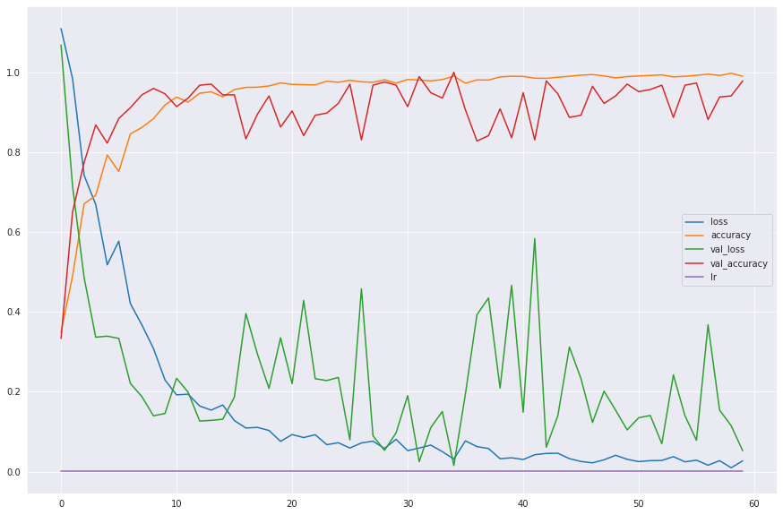
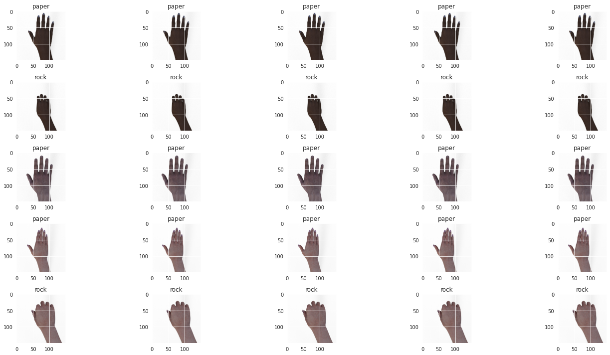
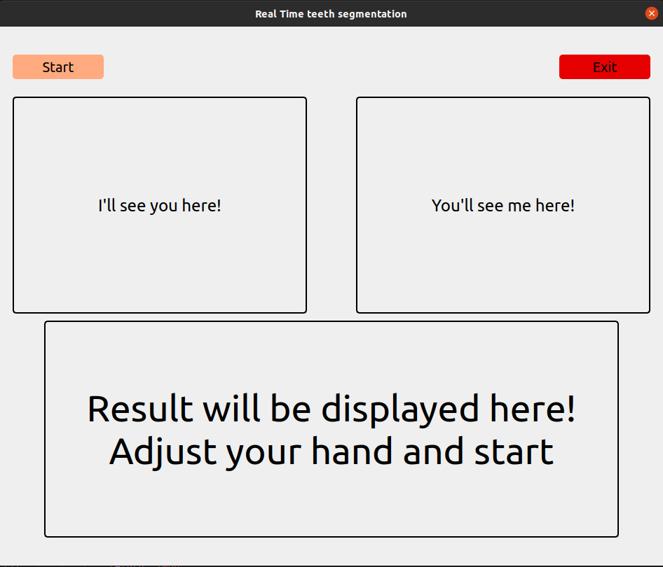
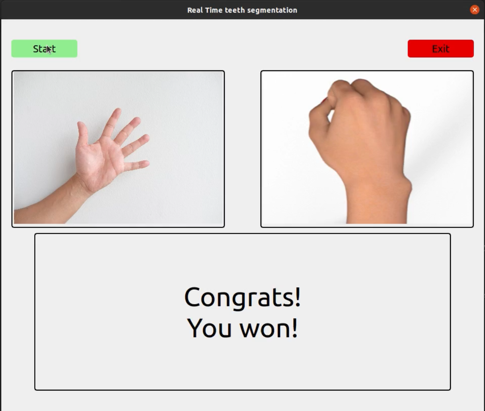

# Rock-Paper-Scissors game using TensorFlow, OpenCv and PyQt5.

This project consists an application which can be used for the entertainment of Patients in Hospitals. The application comprises a Graphical User Interphase(GUI) which created using a python GUI library called PyQt5.


The project is tested against **TensorFlow 2.7.0**, **Keras 2.7.0-tf**, and **Python 3.8.10** for the following system specifications:
1. GPU - `GeForce RTX 3060 12GiB` and `GeForce GTX 1050 4GiB`
3. OS - `Ubuntu20.04`

**Note:** `This project does not support any of the available versions of Tensorflow1.`

# Use the Project Without Installation

It is not required to install the project. It is enough to copy the `main.py` script, `guess` directory, and `my_model1.h5` classification model.

The directory tree of the project is as follows:

```
Rock-Paper-Scissors:
*guess:
    -paper.png
    -rock.png
    -scissors.png
 *logs:
    -logs.xlsx
*main.py
```

# Training of classification model

The classification [model](https://github.com/Kamlesh364/Rock-Paper-Scissors-Using-CV/my_model1.h5) used in this project is trained on the open source [dataset](https://laurencemoroney.com/datasets.html#rock-paper-scissors-dataset) comprising artificial hand positions for demonstration of rock-paper-scissors.

The training performance of this model is shown below:



Test results:



# Getting Started

1. Clone the repository
```bash
git clone https://github.com/Kamlesh364/Rock-Paper-Scissors-Using-CV/
```
3. Install dependencies
```bash
pip3 install -r requirements.txt
```
3. Run setup from the repository root directory
```bash
python3 main.py
```

# Graphical User Interphase



1. The patient can adjust his hand position (rock or paper or scissor) in fron of the web cam and press `Start` to begin the game.

2. The application guesses computer's move and shows the results on the screen, simultaneously every move of the patient is recorded in `logs\logs.xlsx`. 



3. Once the result of first round is shown, the GUI waits for 3 seconds to let the patient adjust his/her hand again, oppposite the camera.

4. This process continues till the user presses `Exit` to stop the game and close the GUI.

5. Demonstration of the working of this GUI application can be found [here](https://drive.google.com/file/d/12YZDkdVjLMcukAtw5pRUSMxh4iSgUUB-/view?usp=sharing).
